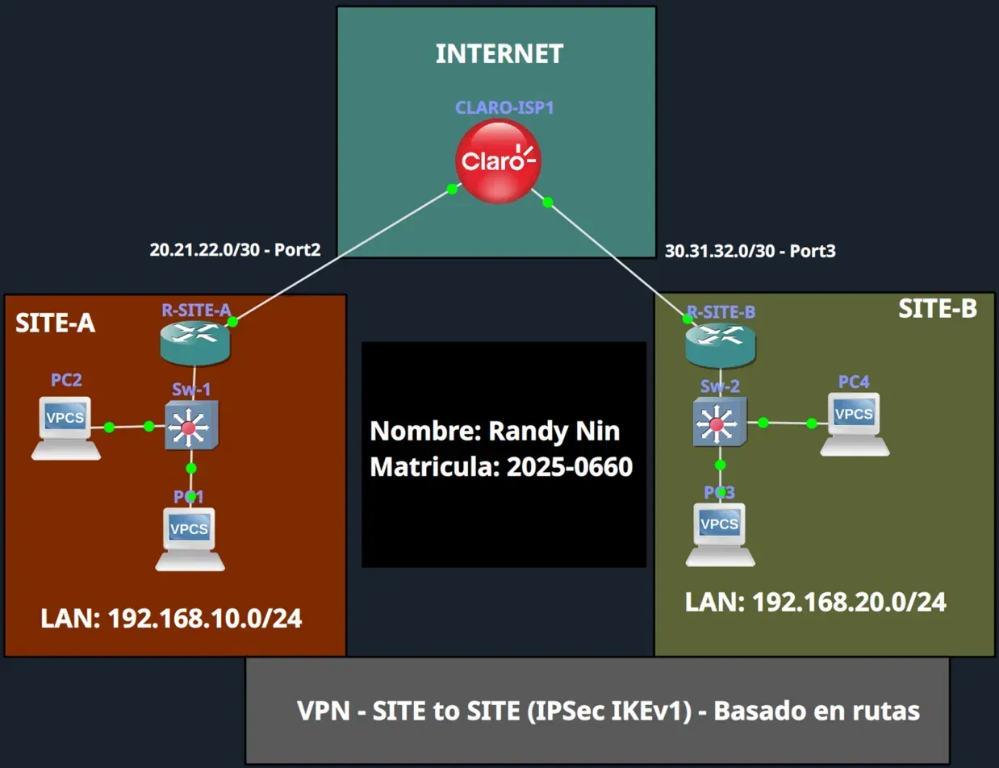
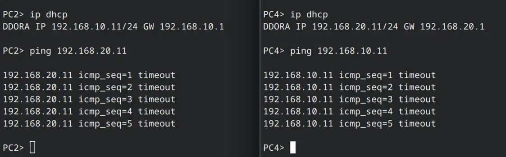
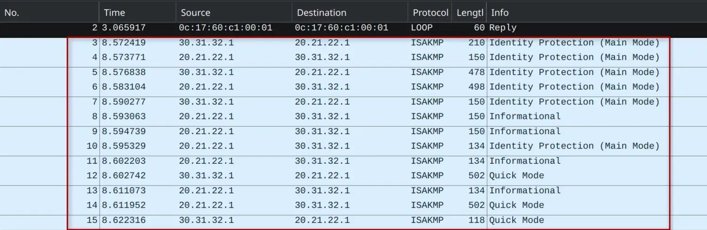
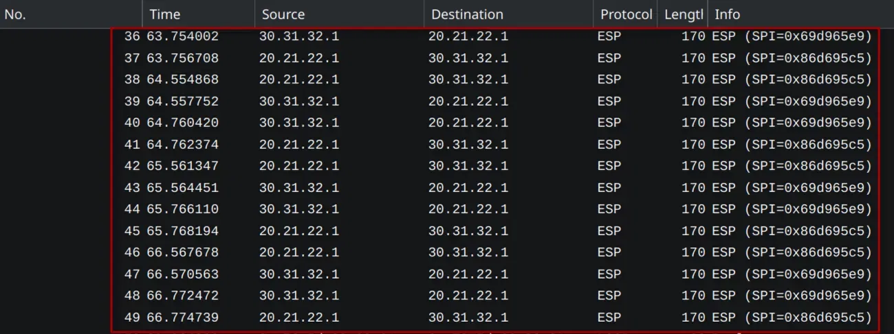
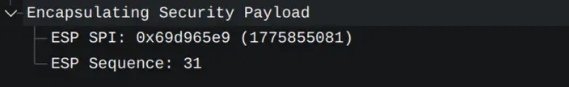
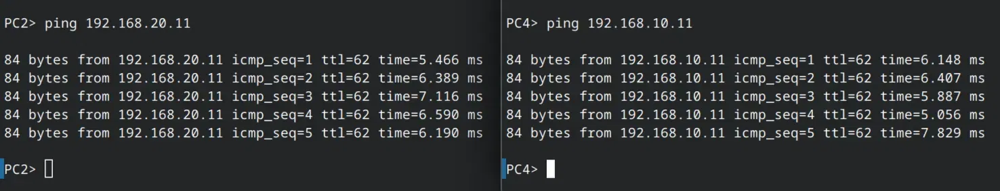
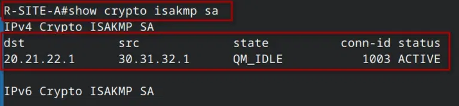
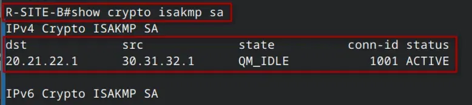
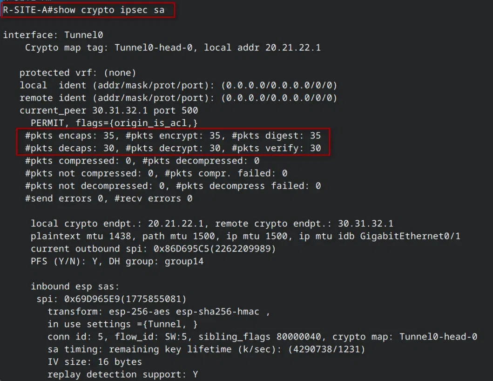
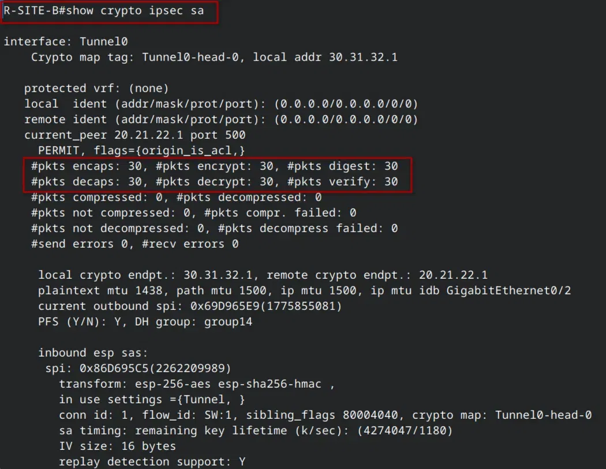

# SITE-SITE-IKEv1-ROUTE-BASED

> **Autor:** Randy Nin **|**  **Laboratorio de Redes | GNS3**

Implementación completa de una VPN Site-to-Site IPSec IKEv1 en modalidad Route-Based mediante Virtual Tunnel Interfaces (VTI) sobre Cisco IOS. A diferencia de la modalidad Policy-Based que usa una ACL y un crypto map para clasificar el tráfico a cifrar, Route-Based crea una interfaz lógica Tunnel con dirección IP propia y delega la decisión de cifrado a la tabla de enrutamiento: cualquier ruta que apunte a Tunnel0 hace que ese tráfico se cifre automáticamente con AES-256 y SHA-256.

---

## Contenido del repositorio

```
SITE-SITE-IKEv1-ROUTE-BASED/
├── IMG/
│   ├── topology.png
│   ├── before-vpn-ping.png
│   ├── after-vpn-ping.png
│   ├── wireshark-isakmp.png
│   ├── wireshark-esp.png
│   ├── wireshark-esp-detail.png
│   ├── sitea-isakmp-sa.png
│   ├── siteb-isakmp-sa.png
│   ├── sitea-ipsec-sa.png
│   └── siteb-ipsec-sa.png
├── route-based
├── Documentación Tecnica Profesional VPN Site-to-Site - IPSec IKEv1 - Route-Based (Randy Nin -- 2025-0660).pdf
└── README.md
```

---

## Documentación técnica

La documentación técnica completa está disponible en:

**[Documentación Tecnica Profesional VPN Site-to-Site - IPSec IKEv1 - Route-Based (Randy Nin -- 2025-0660).pdf](./Documentación%20Tecnica%20Profesional%20VPN%20Site-to-Site%20-%20IPSec%20IKEv1%20-%20Route-Based%20(Randy%20Nin%20--%202025-0660).pdf)**

---

## Topología



|Dispositivo|Interfaz|IP|Rol|
|:--|:--|:--|:--|
|CLARO-ISP|Gi0/1|20.21.22.2/30|Enlace hacia SITE-A|
|CLARO-ISP|Gi0/2|30.31.32.2/30|Enlace hacia SITE-B|
|R-SITE-A|Gi0/0|192.168.10.1/24|Gateway LAN SITE-A|
|R-SITE-A|Gi0/1|20.21.22.1/30|WAN / tunnel source|
|R-SITE-A|Tunnel0|172.16.0.1/30|VTI endpoint|
|R-SITE-B|Gi0/0|192.168.20.1/24|Gateway LAN SITE-B|
|R-SITE-B|Gi0/2|30.31.32.1/30|WAN / tunnel source|
|R-SITE-B|Tunnel0|172.16.0.2/30|VTI endpoint|

---

## Diferencia clave vs Policy-Based

|Aspecto|Policy-Based|Route-Based (este lab)|
|:--|:--|:--|
|Selección de tráfico|ACL de tráfico interesante|Tabla de enrutamiento (rutas a Tunnel0)|
|Componente IPSec|`crypto map` en interfaz WAN|`crypto ipsec profile` en interfaz Tunnel|
|Selectores Fase 2|Subredes específicas|0.0.0.0/0 (universal)|
|Enrutamiento dinámico|No soportado|Soportado (OSPF, EIGRP, BGP sobre Tunnel0)|

---

## Configuración VPN

El archivo de configuración completo está disponible en [`Route-Based`](./Route-Based). A continuación, los bloques clave:

**Fase 1: política ISAKMP (simétrica en ambos routers)**

```
crypto isakmp policy 10
 encryption aes 256
 hash sha256
 authentication pre-share
 group 14
 lifetime 86400

! En R-SITE-A:
crypto isakmp key randy123 address 30.31.32.1

! En R-SITE-B:
crypto isakmp key randy123 address 20.21.22.1
```

**Fase 2: transform-set + IPSec profile (en lugar de crypto map)**

```
crypto ipsec transform-set TRANF_SET esp-aes 256 esp-sha256-hmac
 mode tunnel

! En R-SITE-A:
crypto ipsec profile IPSEC_SITEA_VTI
 set transform-set TRANF_SET
 set pfs group14

! En R-SITE-B:
crypto ipsec profile IPSEC_SITEB_VTI
 set transform-set TRANF_SET
 set pfs group14
```

**Virtual Tunnel Interface + enrutamiento**

```
! En R-SITE-A:
interface Tunnel0
 ip address 172.16.0.1 255.255.255.252
 tunnel source GigabitEthernet0/1
 tunnel destination 30.31.32.1
 tunnel mode ipsec ipv4
 tunnel protection ipsec profile IPSEC_SITEA_VTI

ip route 192.168.20.0 255.255.255.0 Tunnel0

! En R-SITE-B:
interface Tunnel0
 ip address 172.16.0.2 255.255.255.252
 tunnel source GigabitEthernet0/2
 tunnel destination 20.21.22.1
 tunnel mode ipsec ipv4
 tunnel protection ipsec profile IPSEC_SITEB_VTI

ip route 192.168.10.0 255.255.255.0 Tunnel0
```

---

## Antes de la VPN: sin conectividad

Sin el tunnel configurado, los hosts de ambas LANs no pueden comunicarse. El tráfico entre redes privadas no tiene ruta a través del ISP.



---

## Negociación IKEv1

Al generarse tráfico interesante, los routers negocian automáticamente el tunnel. Wireshark confirma los mensajes ISAKMP: Main Mode para Fase 1 y Quick Mode para Fase 2.



---

## Tráfico cifrado con ESP

Una vez establecido el tunnel, el tráfico entre LANs viaja completamente cifrado. Wireshark solo puede ver la cabecera IP externa y el bloque ESP opaco.





---

## Conectividad establecida

Con el tunnel activo, los hosts de ambas LANs se comunican correctamente a través de la VTI.



---

## Verificación del tunnel

### show crypto isakmp sa

Confirma que la SA de Fase 1 está activa (`QM_IDLE` es el estado operacional normal).

**R-SITE-A:**



**R-SITE-B:**



---

### show crypto ipsec sa

Confirma que las SAs de Fase 2 están activas con la interfaz **Tunnel0** y selectores universales (0.0.0.0/0). Los SPIs son complementarios entre ambos extremos.

**R-SITE-A:**



**R-SITE-B:**



|Contador|R-SITE-A|R-SITE-B|
|:--|:-:|:-:|
|encaps / encrypt / digest|35 / 35 / 35|30 / 30 / 30|
|decaps / decrypt / verify|30 / 30 / 30|30 / 30 / 30|
|Outbound SPI|0x86D695C5|0x69D965E9|
|Inbound SPI|0x69D965E9|0x86D695C5|

---

## Video demostrativo

**LINK:** [https://youtu.be/TewgZAqRmJQ](https://youtu.be/TewgZAqRmJQ)
---

_Randy Nin / Matrícula 2025-0660_

---

